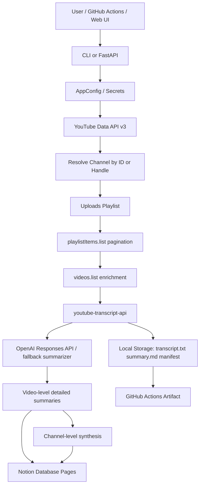

# YouTube Channel → Notion Knowledge Base

YouTubeチャンネルのURLを1つ渡すだけで、公開アップロード動画を全件列挙し、動画ごとの字幕/文字起こしを取得し、情報量を落としすぎない詳細サマリーに再構成し、Notionデータベースへ保存するアプリです。

NotebookLMのように「資料群を知識ベース化する」体験を、YouTubeチャンネル単位で実行するための実装です。代表動画だけではなく、アップロード一覧をページングで最後まで走査し、各動画を個別ページとしてNotionに保存し、最後にチャンネル全体の統合サマリーも作成します。

初期サンプルURLとして、依頼時に共有された `https://youtube.com/@macamp0817?si=U7FfYoWVQQLMvJf0` を `.env.example` とWeb UIの初期値に入れています。

## できること

- YouTubeチャンネルURL、`@handle` URL、`/channel/UC...` URLからチャンネルを解決
- YouTube Data API v3でチャンネルの uploads playlist を取得し、`playlistItems.list` を全ページ走査
- 各動画のタイトル、URL、公開日、概要、再生数、尺などを保存
- `youtube-transcript-api` で手動字幕・自動字幕を取得
- 文字起こしを動画ごとに `transcript.txt` として保存
- OpenAI Responses APIで長文を分割要約し、動画単位の詳細ノートに統合
- 全動画サマリーをさらに統合し、チャンネル総合ナレッジベースを作成
- Notionデータベースに動画ごとのページとチャンネル総合ページを作成
- Notionのrich text制限に合わせて長文をブロック分割
- GitHub Actionsの `workflow_dispatch` でクラウド実行し、成果物をArtifactとして保存
- CLI、FastAPI Web UI、devcontainer、pytest、ruff、CIを同梱

## 重要な前提と限界

このアプリは「動画を漏らさない」ことを最優先し、取得できなかった字幕も `missing_transcript` としてmanifestとNotionに残します。非公開、限定公開、メンバー限定、削除済み、地域/年齢制限、字幕が存在しない動画、字幕取得API側のブロックなどは、本文取得ができない場合があります。その場合も動画行は消さず、抜け漏れ監査対象として保存します。

本番品質の詳細サマリーには `OPENAI_API_KEY` が必要です。未設定でもローカル抽出型の暫定サマリーは作成します。

## アーキテクチャ



### 処理フロー

1. チャンネルURLを受け取ります。
2. `@handle` は YouTube Data API の `channels.list(forHandle=...)` でチャンネルIDに解決します。
3. チャンネルの `contentDetails.relatedPlaylists.uploads` からアップロード用プレイリストIDを取得します。
4. `playlistItems.list` を `nextPageToken` がなくなるまで繰り返し、公開アップロードを全件取得します。
5. `videos.list` で動画の詳細メタデータを補完します。
6. 各動画IDに対して字幕を取得し、タイムスタンプ付きのテキストに整形します。
7. 長い文字起こしはチャンク分割し、各チャンクを詳細ノート化した上で動画単位に統合します。
8. 全動画の詳細サマリーをチャンネル総合サマリーへ統合します。
9. Notionに動画ごとのページとチャンネル総合ページを作成します。
10. ローカルには `manifest.json`、`manifest.csv`、`channel_summary.md`、動画ごとの `summary.md` / `transcript.txt` を保存します。

## セットアップ

### 1. ローカル実行

```bash
cp .env.example .env
python -m venv .venv
source .venv/bin/activate
python -m pip install --upgrade pip
pip install -e '.[dev]'
```

`.env` に最低限以下を設定します。

```bash
YOUTUBE_API_KEY=your_youtube_data_api_key
OPENAI_API_KEY=your_openai_api_key
NOTION_TOKEN=secret_xxx
NOTION_DATABASE_ID=xxxxxxxxxxxxxxxxxxxxxxxxxxxxxxxx
# または NOTION_PARENT_PAGE_ID を設定すると、初回実行時にDBを自動作成します。
```

実行:

```bash
yt-notion-digest run --channel-url "https://youtube.com/@macamp0817?si=U7FfYoWVQQLMvJf0" --max-videos 0
```

`--max-videos 0` は全件です。初回テストは `--max-videos 3` を推奨します。

### 2. Web UI

```bash
yt-notion-digest serve --port 8000
```

ブラウザで `http://localhost:8000` を開きます。長時間処理や全件処理はGitHub ActionsまたはCLIのほうが安定します。

### 3. GitHub Actionsでクラウド実行

Repository Settings → Secrets and variables → Actions に以下を設定します。

Secrets:

- `YOUTUBE_API_KEY`
- `OPENAI_API_KEY`
- `NOTION_TOKEN`
- `NOTION_DATABASE_ID` または `NOTION_PARENT_PAGE_ID`

Variables 任意:

- `OPENAI_MODEL`（既定: `gpt-5.4-mini`）
- `LANGUAGES`（既定: `ja,en`）
- `NOTION_INCLUDE_TRANSCRIPT`（既定: `true`）
- `NOTION_DATABASE_TITLE`

Actions → CI → Run workflow で `channel_url` に対象チャンネルURLを入れて実行します。成果物は `youtube-channel-knowledge-outputs` Artifact に保存されます。

## Notion側の保存形式

既存DBを使う場合、以下のプロパティを用意してください。`NOTION_PARENT_PAGE_ID` を使う場合は、このアプリが同じスキーマのDBを自動作成します。

| Property | Type | 内容 |
| --- | --- | --- |
| Name | Title | 動画タイトル / チャンネル総合サマリー |
| Video ID | Rich text | YouTube video ID または `CHANNEL_SUMMARY:<channel_id>` |
| Video URL | URL | 動画URL |
| Channel | Rich text | チャンネル名 |
| Published | Date | 公開日 |
| Status | Select | `done`, `missing_transcript`, `error`, `channel_summary` |
| Word Count | Number | 文字起こし語数 |
| Summary Model | Rich text | 使用モデル |
| Synced At | Date | 同期日時 |

## GPT Imageで作る運用ガイド画像

初心者向けの操作手順画像を作る場合は、`docs/gpt-image-guide.md` のプロンプトを `gpt-image-2` などの最新画像生成モデルに渡すことで、YouTube APIキー作成、Notion Integration作成、GitHub Actions Secrets設定の流れを1枚のガイド画像にできます。README本文ではMermaid図で処理の全体像を表し、必要に応じて画像ガイドを追加生成できる構成にしています。

## 本番運用に必要なもの

- YouTube Data API v3 key
- Notion Internal Integration token
- Notion Database ID、またはDBを作る親ページID
- OpenAI API key
- 長時間実行用のGitHub Actions、Codespaces、サーバー、またはローカルPC
- 大量動画を処理する場合のAPI利用量・費用・実行時間の見積もり

## 開発

```bash
pip install -e '.[dev]'
ruff check .
pytest
```

## ライセンスと注意

このリポジトリはMIT Licenseです。YouTube、Notion、OpenAIの利用規約、API利用制限、著作権、チャンネル所有者の権利を尊重して運用してください。取得した文字起こしや要約を外部公開する場合は、必ず権利関係を確認してください。
