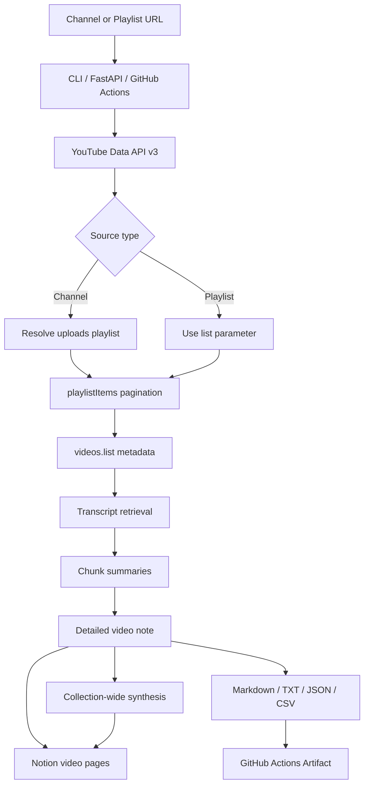

# YouTube Channel / Playlist → Notion Knowledge Base

YouTubeチャンネルまたはプレイリストのURLを1つ渡すだけで、公開動画を全件列挙し、動画ごとの字幕/文字起こしを取得し、情報量を落としすぎない詳細サマリーに再構成し、Notionデータベースへ保存するアプリです。

NotebookLMのように「資料群を知識ベース化する」体験を、YouTubeチャンネルまたはプレイリスト単位で実行します。代表動画だけではなく、対象リストをページングで最後まで走査し、各動画を個別ページとしてNotionに保存し、最後に全体統合サマリーも作成します。

## できること

- YouTubeチャンネルURL、`@handle` URL、`/channel/UC...` URLを解決
- `playlist?list=...` または `watch?...&list=...` のプレイリストURLを解決
- YouTube Data API v3で対象プレイリストを全ページ走査
- 各動画のタイトル、URL、公開日、概要、再生数、尺などを保存
- `youtube-transcript-api` で手動字幕・自動字幕を取得
- OpenAI Responses APIで長文を分割要約し、動画単位の詳細ノートに統合
- 全動画サマリーをさらに統合し、全体ナレッジベースを作成
- Notionデータベースに動画ごとのページと総合ページを作成
- GitHub Actionsの `workflow_dispatch` でクラウド実行し、成果物をArtifactとして保存
- CLI、FastAPI Web UI、devcontainer、pytest、ruff、CIを同梱

## 実行例

チャンネル全件:

```bash
yt-notion-digest run \
  --channel-url "https://youtube.com/@macamp0817" \
  --max-videos 0
```

プレイリスト全件:

```bash
yt-notion-digest run \
  --channel-url "https://youtube.com/playlist?list=PL0pHg9WQBbWZqnTu9vqMUdwsxRaZIB0Ja" \
  --max-videos 0
```

`--channel-url` というオプション名は後方互換のため維持していますが、プレイリストURLもそのまま渡せます。

## 必要なSecrets

GitHub ActionsのRepository Secretsに以下を設定します。

- `YOUTUBE_API_KEY`
- `OPENAI_API_KEY`
- `NOTION_TOKEN`
- `NOTION_DATABASE_ID` または `NOTION_PARENT_PAGE_ID`

任意のRepository Variables:

- `OPENAI_MODEL`（既定: `gpt-5.4-mini`）
- `OPENAI_MAX_OUTPUT_TOKENS`（既定: `6000`）
- `LANGUAGES`（既定: `ja,en`）
- `NOTION_INCLUDE_TRANSCRIPT`（既定: `true`）
- `NOTION_DATABASE_TITLE`

## アーキテクチャ



詳細は `docs/architecture.md`、初期設定は `docs/setup.md` を参照してください。

## 完全性と制約

対象プレイリストまたはチャンネルの公開動画一覧は `nextPageToken` がなくなるまで取得します。字幕を取得できない動画も削除せず、`missing_transcript` としてmanifestとNotionに残します。

非公開、削除済み、メンバー限定、地域/年齢制限、字幕なし、YouTube側のアクセス制限がある動画では本文を取得できない場合があります。OpenAI、YouTube Data API、Notion APIのSecretsがない場合、本番の全件同期は実行できません。

## 開発

```bash
pip install -e '.[dev]'
ruff check .
pytest
```

## GPT Image運用ガイド

初心者向けのセットアップ画像を生成するためのプロンプトを `docs/gpt-image-guide.md` に収録しています。READMEと `docs/architecture.md` にはMermaidによる全体構成図も含めています。

## ライセンスと注意

YouTube、Notion、OpenAIの利用規約、API制限、著作権、チャンネルおよび動画権利者の権利を尊重して運用してください。取得した全文文字起こしを外部公開する場合は、権利関係を確認してください。
