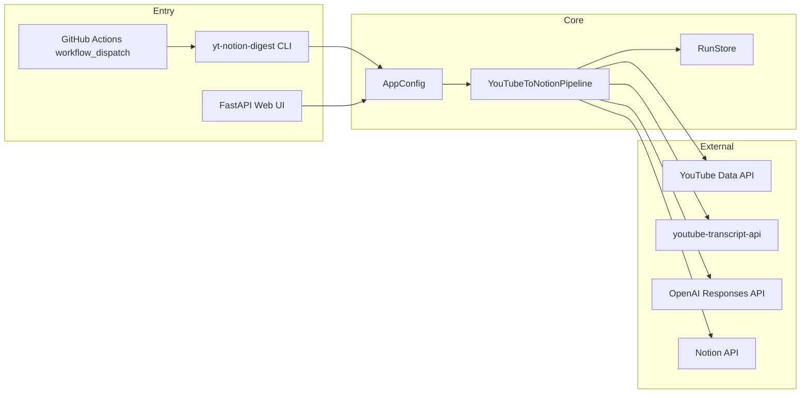
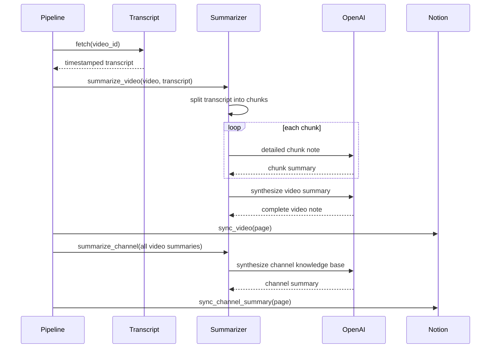

# Architecture

このアプリは、YouTubeチャンネルを「動画単位の詳細ノート」と「チャンネル全体の統合ノート」に変換し、Notionへ同期するバッチ処理アプリです。

## コンポーネント

## データモデル

- `Channel`: チャンネルID、タイトル、URL、uploads playlist ID、動画数など
- `Video`: 動画ID、タイトル、URL、公開日、概要、尺、再生数など
- `TranscriptResult`: 字幕取得ステータス、本文、言語、生成字幕かどうか、エラー
- `VideoSummary`: 動画単位のMarkdownサマリー、使用モデル、分割数
- `PipelineResult`: 実行結果、出力先、Notion DB ID、エラー一覧

## 完全性の考え方

このアプリでの「抜け漏れなく」は、次の2段階で実現します。

1. チャンネルの公開アップロード一覧をYouTube Data APIからページングで最後まで取得する。
2. 字幕が取れない動画も落とさず、`missing_transcript` としてmanifestとNotionに残す。

これにより、「代表的な数本だけ要約される」問題を避け、動画一覧そのものの監査可能性を確保します。

## Notion同期

Notionでは1動画 = 1ページとして保存します。ページ本文にはメタデータ、詳細サマリー、オプションでフル文字起こしを保存します。長文はNotion APIのrich text制限に合わせて1900文字以下のブロックへ分割し、100ブロックずつappendします。

既存ページは `Video ID` で検索し、重複作成を避けます。既存ページの古いブロック削除は行わず、再同期内容を追記します。これにより履歴を残します。

## Summarization strategy

OpenAI APIキーがない場合はローカル抽出型フォールバックを使います。これは開発・CI用であり、本番品質ではOpenAIモデルの利用を推奨します。

## 拡張案

- 字幕がない動画に対する、権利許諾済み音声ファイルからの文字起こしフロー追加
- Notion既存ページのブロック差し替え更新
- 動画コメント、概要欄リンク、チャプター抽出
- 埋め込み検索用のベクトルDB追加
- チャンネルを複数登録するスケジューラ
- 差分実行: 新規動画だけ処理
